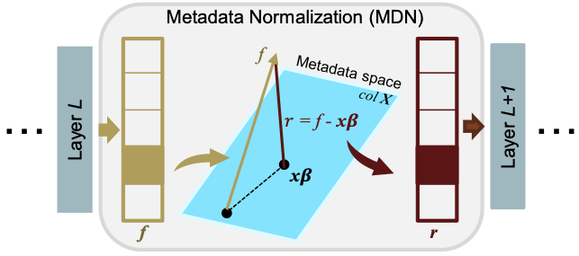

# Metadata Normalization

This repository is the official implementation of: 

[**Metadata Normalization**](https://arxiv.org/abs/2104.09052)\
Mandy Lu, Qingyu Zhao, Jiequan Zhang, Kilian M. Pohl, Li Fei-Fei, Juan Carlos Niebles, Ehsan Adeli\
*CVPR 2021*



*The proposed Metadata Normalization operation. MDN layer takes the learned features from the previous layer (f), analyzes the effects of the metadata on them, residualizes such effects, and outputs the distribution corrected features (r).*

The video presentation of this work at CVPR can be viewed [here](https://www.youtube.com/watch?v=NX4Xz86khUE&ab_channel=MandyLu).

## Requirements

To install requirements, run:

```setup
pip install -r requirements.txt
```

with Python 3 (3.8 used).

## Synthetic Data Generation

```synthetic_data_vis.ipynb``` provides step-by-step instructions for generating synthetic data and visualizes the inputs.

## Training

To train the model(s) in the paper, run this command:

```train
python train.py --mdn <mdn_type> 
                --model_dir <params_and_output_path> 
                --batch_size <batch_size> 
                --epochs <num_epochs> 
                --N <group size> 
                --runs <num_runs> 
                --seed <random_seed> 
                --lr <learning_rate>
```

or use

```train
python train.py
```

for the default mode. 


## References

If you use this code in your research, please cite our [paper](https://arxiv.org/abs/2104.09052).

```
@inproceedings{lu2021metadata,
  title={Metadata Normalization},
  author={Lu, Mandy and Zhao, Qingyu and Zhang, Jiequan and Pohl, Kilian M and Fei-Fei, Li and Niebles, Juan Carlos and Adeli, Ehsan},
  booktitle={Proceedings of the IEEE/CVF Conference on Computer Vision and Pattern Recognition},
  pages={10917--10927},
  year={2021}
}
```

These resources were used or cited within the code:

- Synthetic Data Generation [paper](https://arxiv.org/abs/1910.03676) [code](https://github.com/QingyuZhao/BR-Net).

## Contact for Questions

Mandy Lu, mlu@cs.stanford.edu
